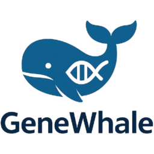

[//]: # ([![Version]&#40;https://img.shields.io/github/v/release/SaedSilva/GeneWhale?sort=semver&display_name=release&label=alpha&color=brightgreen&#41;]&#40;&#41;)

[//]: # ([![Github All Releases]&#40;https://img.shields.io/github/downloads/SaedSilva/GeneWhale/total.svg&#41;]&#40;&#41;)

<div align="center">
    
    <h1 align="center">GeneWhale: A Utility Tool for Pan-Genome Analysis Using Docker</h1>
</div>


Software made with:


Operational systems available:


---

### WARNING

**This project is still in development.**
**The current version is not fully functional.**
**And the release download is not available yet.**
**Probably project name will change.**
**For use at this moment, please use the source code with jdk 21.**

Clone this project:

```bash
git clone https://github.com/SaedSilva/GeneWhale.git
```

Create a package for your OS using the following command:

```bash
./gradlew build composeApp:packageDistributionForCurrentOS
```

Or create a jar file using the following command:

```bash
./gradlew build composeApp:packageUberJarForCurrentOS
```

---

GeneWhale is a utility tool designed to simplify the analysis of pan-genomes by acting as a wrapper for commonly used
tools, leveraging Docker for seamless execution.

### Requirements

To use GeneWhale, you must have [Docker](https://docs.docker.com/get-docker/) installed on your machine.  
Additionally, Docker must be running (i.e., the Docker daemon must be active).  
To verify if Docker is running, use the following command:

```bash
docker info
```

- If Docker is running, you will see detailed information about your Docker configuration.
- If it is not running, you will see an error message indicating that the Docker daemon is not active.

### Supported Platforms

GeneWhale is available for **Windows**, **Linux**, and **macOS**.

You can download the appropriate version for your operating system from the **Releases** section.

### Running the Tool

We recommend using the `.jar` file if you already have **Java 21 or higher** installed on your system.  
You can download the latest JDK from the official website:  
[https://www.oracle.com/java/technologies/javase/jdk21-archive-downloads.html](https://www.oracle.com/java/technologies/javase/jdk21-archive-downloads.html)

Alternatively, you can use the installer provided for your operating system.

---

### Pan genomes Tools progress:

Marked tool is minimally functional and can be used for pan-genome analysis.
The progress bar indicates the percentage of addition of the tool's parameters and functionalities.

- [X] Panaroo 
- [ ] Roary 
- [ ] Ppanggolin 
- [ ] Pirate 
- [ ] Peppan 
- [ ] Pandelos 
- [ ] Panacota 
- [ ] Ribap 
- [ ] Pato 
- [ ] Micropan 
- [ ] GET_HOMOLOGUES 
- [ ] PanCake 
- [ ] PGAP-X 
- [ ] PanFunPro 
- [ ] SplitMEM 
- [ ] Panakeia 
- [ ] PANPROVA 
- [ ] BGDMdocker 
- [ ] DeNoGAP 
- [ ] Harvest 
- [ ] NGSPanPipe 
- [ ] PanACEA 
- [ ] PANINI 
- [ ] PanOCT 
- [ ] Panseq 
- [ ] PanTetris 
- [ ] Spine e AGEnt 
- [ ] Pyseer 
- [ ] Seq-pan-seq 
- [ ] Ptolemy 


### License
This project is licensed under the GNU Affero General Public License v3.0 (AGPL-3.0).
You can find the full license text in the [LICENSE](LICENSE) file.


### Contributors

